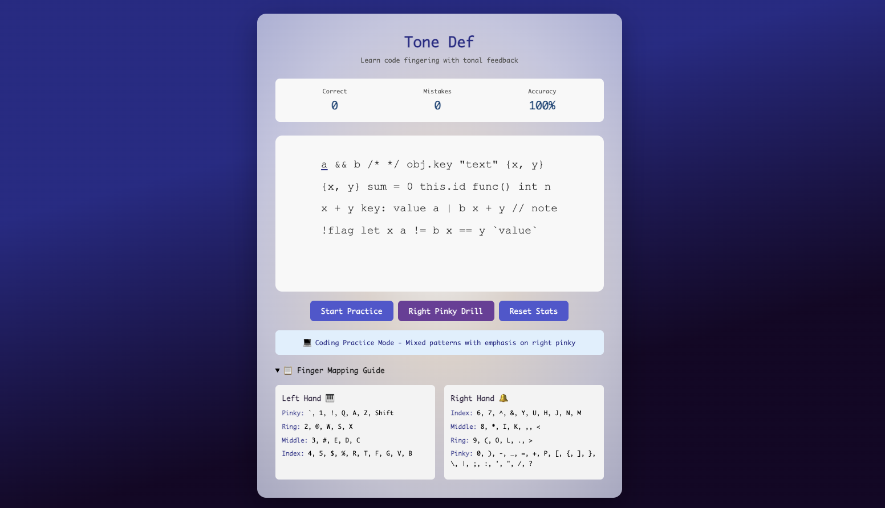

# Tone Def

A coding-focused typing practice tool that provides musical feedback based on finger position. Strengthen your code typing technique with tonal feedback.

Created using Claude to meet my personal desire for code-centric typing practice with auditory feedback.



## How to Use (Outside Vercel)

1. Download repository and extract 
2. Open `index.html` in your web browser
2. Click "Start Practice" for general coding practice or "Right Pinky Drill" for focused practice
3. Type the characters shown on screen
4. Listen to the tonal feedback and watch your accuracy improve!

## Features

- **Tonal Feedback**: Different tones for left and right hands
- **Finger-Mapped Pitches**: Each finger gets its own pitch (pinkies low, index fingers high)
- **Coding Practice Mode**: Focuses on common coding patterns with punctuation and symbols
- **Right Pinky Drill**: Extra practice for the most challenging keys: `0 ) - _ = + P [ { ] } \ | ; : ' " / ?`
- **Real-time Stats**: Track accuracy and mistakes as you practice

## Not Trained

- **Most Control Keys**: Ctrl, Opt, Alt, Home, End, Esc, Arrows, Page Up/Down, Caps Lock, Tab, Backspace/Delete

## Customization Ideas

You can easily customize this project:

### Change Sound Design
In `app.js`, modify the `fingerPitches` object to change the musical scale:
```javascript
const fingerPitches = {
    leftPinky: 48,    // C3
    leftRing: 52,     // E3
    // ... etc
};
```

### Add More Practice Patterns
Add to the `codingPatterns` or `rightPinkyPatterns` arrays - don't forget escape syntax:
```javascript
const codingPatterns = [
    'your new pattern here',
    // ... existing patterns
];
```

### Adjust Styling - Colors, Fonts, Shapes, etc
Edit `style.css` to modify. The main colors are:
- Purple gradient: `#667eea` to `#764ba2`
- Correct feedback: `#305224` (deep sage)
- Incorrect feedback: `#bb522c` (terra cotta)

### Change Timing/Duration
Modify the audio envelope in the `playTone()` function:
```javascript
gainNode.gain.exponentialRampToValueAtTime(0.01, now + 0.4); // Duration
```

## License

Standard MIT license for Open Source 

Have fun and happy typing! 🎵⌨️
